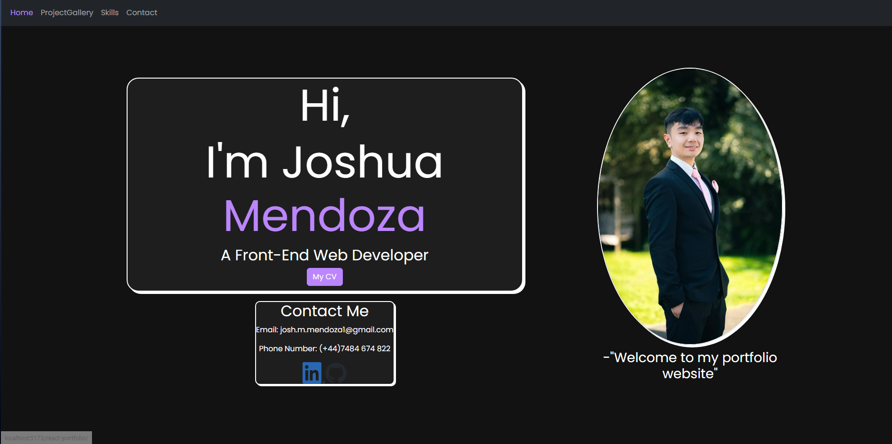

# React-Portfolio
Link to Repository: https://github.com/josh484/react-portfolio  
Link to Website: https://josh484.github.io/react-portfolio/
## Description
A Portfolio website using everything I have learned so far through React+Vite.
## Table of Contents
[Installation](#installation)  
[Usage](#usage)  
[Lisence](#lisence)  
[Tests](#tests)  
[Questions](#questions) 
## Installation
In order to install the project simply click the green code button and download the file as a zip. Once downloaded simply right click on the file and unzip the folder.
## Usage
Clicking on the website link will take you to the website, press the navigation tabls on the top of the page to switch between pages.

## Lisence
This work is using the lisence: MIT
## Features
The Website features 4 main pages, The Home page, Project Gallery, Skills and Contact pages.
- Home Page is the starting screen and offers information about me and links to my socials.
- Project Gallery is a bootstrap carousel which uses a map function to dynamically create each instance of a project within the carousel using a JSON file so that more can be added just by adding more projects to the JSON file.
- Skills uses two jsx files the main Skills Gallery which is similar to project gallery only this time it maps over the skills javascript which creates a card using a JSON file for each skill this is so that I can easily put more skills that I will learn in the future.
- Contact Page is a simple edited bootstrap form that on submission uses an application called getform to handle the input and send it to my email.
- The navigation uses Router Dom in order to create a single paged application so that the page is never refreshed.
## Questions
Github username: josh484   
[GitHub](https://www.github.com/josh484)  
Reach out to me for additional instructions at: [josh.m.mendoza1@gmail.com](mailto:josh.m.mendoza1@gmail.com.com)